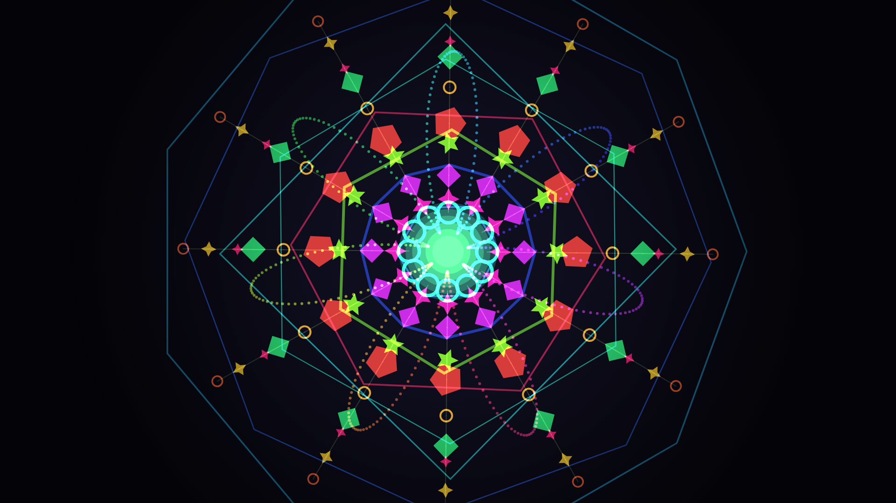

# Geo Motion — complex kaleidoscopic geometric loop (p5.js)

A dense, colourful mandala: K-fold kaleidoscopic symmetry, rotating polygon
rings, an animated spoke of morphing shapes (discs, stars, polygons, plus…),
a glowing spirograph rose, and a rainbow HSB hue that cycles over the loop.
Fully procedural, no build step — open `index.html`.

The animation is a **seamless loop** (default 10 s): every rotation and
oscillation runs a whole number of cycles per loop, and the hue advances a
whole number of full rainbows, so it returns exactly to its start.



## Run
Open `index.html` in a browser. Only external resource: the p5.js CDN.

## Controls
| Key | Action |
|-----|--------|
| **R** | new arrangement (random seed) |
| **S** | save current frame as PNG |
| **E** | export the whole loop as a PNG sequence (`CONFIG.EXPORT`) |
| **H** | seed / loop overlay |

## Tune it (all in `CONFIG`, top of `sketch.js`)
- `SYMMETRY` — fold count of the kaleidoscope (6, 8, 10, 12, 16…)
- `MIRROR` — mirror alternate segments (true kaleidoscope vs pure rotation)
- `HUE_CYCLES` — how many full rainbows sweep per loop (whole number)
- `GLOBAL_SPIN` / `ROSE_SPIN` / ring & shape cycles — motion speeds
  (keep them **whole numbers** so the loop stays seamless)
- `SPOKE_COUNT`, `RINGS`, `ROSE_PETALS` — density/complexity
- toggles: `SHOW_RINGS`, `SHOW_MANDALA`, `SHOW_ROSE`, `SHOW_CORE`, `SHOW_VIGNETTE`
- `BG_HUE / BG_SAT / BG_BRI` — background colour
- `LOOP_FRAMES` — loop length (600 = 10 s at 60 fps)

Colours are generated in HSB, so the whole piece is multi-colour by design;
change the palette feel via `HUE_CYCLES` and the per-element hue spread.

## Render to video
Press **E** to dump frames, then:
```bash
ffmpeg -framerate 60 -i geo_%04d.png -c:v libx264 -pix_fmt yuv420p -crf 18 \
  -movflags +faststart geo_motion_loop.mp4
```
A pre-rendered `geo_motion_loop.mp4` is included.
