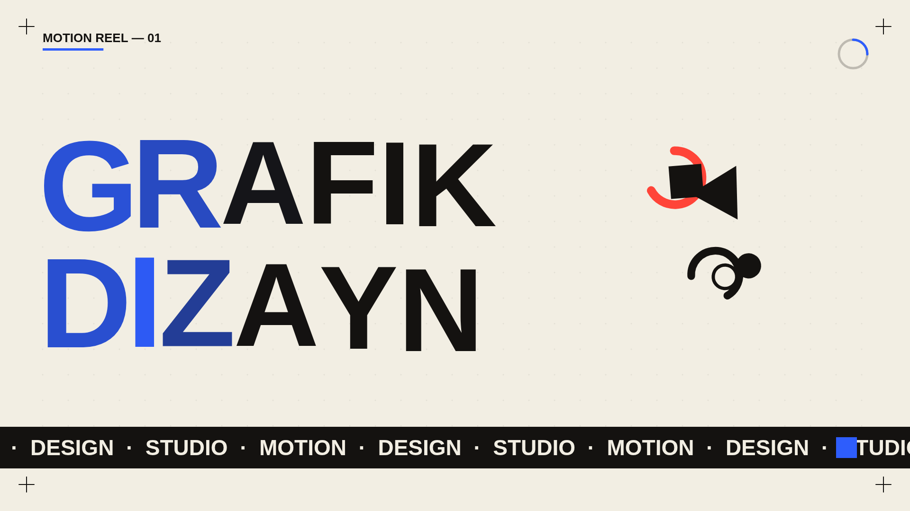

# Graphic Motion — kinetic typography loop (p5.js)

A Swiss / Bauhaus flavoured animated poster: bold headline with a colour
wave rolling across it, an orbiting cluster of primary shapes, a scrolling
marquee, and design details (dot grid, corner registration marks, a
loop-progress dial). Fully procedural, no build step — open `index.html`.

The animation is a **seamless loop** (default 8 s): everything is a
function of the loop position, so it can be looped or exported to a PNG
sequence with no jump.



## Run
Open `index.html` in a browser. The only external resource is the p5.js CDN.

## Controls
| Key | Action |
|-----|--------|
| **R** | new arrangement (random seed) |
| **S** | save current frame as PNG |
| **E** | export the whole loop as a PNG sequence (`CONFIG.EXPORT`) |
| **H** | seed / loop overlay |

## Change the text
Edit the top of `sketch.js`:
```js
HEADLINE: ['GRAFIK', 'DIZAYN'],   // the two big lines — put your own words
LABEL:    'MOTION REEL — 01',     // small top-left label
MARQUEE:  'MOTION  ·  DESIGN  ·  STUDIO  ·  ',  // scrolling strip
```
Long words auto-shrink to fit the width.

## Tweak the look
All numbers live in `CONFIG`, all colours in `C` (as `[r,g,b]`):
- `LOOP_FRAMES` — loop length (480 = 8 s at 60 fps)
- `SWEEP_SPEED` / `BOB_CYCLES` / `ORBIT_CYCLES` / `MARQUEE_TILES` — motion
  (keep these whole numbers so the loop stays seamless)
- toggles: `SHOW_SHAPES`, `SHOW_MARQUEE`, `SHOW_GRID`, `SHOW_CORNERS`, `SHOW_DIAL`
- palette: `C.PAPER`, `C.INK`, and the accents `C.RED/BLUE/YELLOW/GREEN`

## Render to video
Press **E** to dump the frames, then:
```bash
ffmpeg -framerate 60 -i gm_%04d.png -c:v libx264 -pix_fmt yuv420p -crf 18 \
  -movflags +faststart graphic_motion_loop.mp4
```
A pre-rendered `graphic_motion_loop.mp4` is included.
