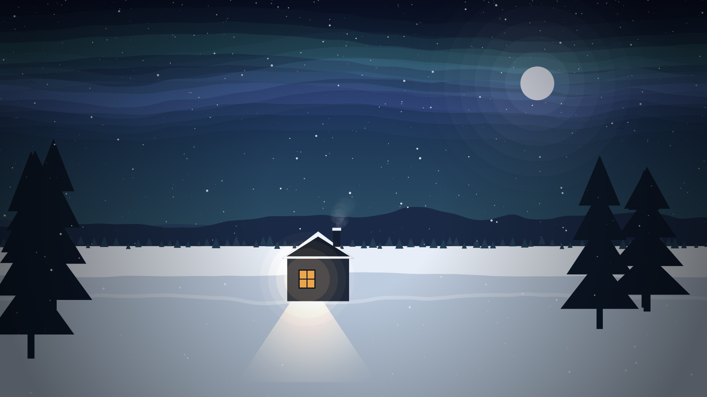

# Animated Winter Night — p5.js

An atmospheric, fully procedural winter-night scene. No images, no fonts,
no audio, no build step. Open `index.html` in any modern browser and it runs.
The only thing loaded from the network is the p5.js library itself (from the
cdnjs CDN); everything you see is drawn from code.

The whole animation is a **seamless 30-second loop**, and it can be exported
to a **PNG sequence** for rendering to video.



## Run it

Just double-click `index.html` (or drag it into a browser tab). That's it —
no server, no npm.

> The scene needs the p5.js CDN to load once. After that it runs entirely
> offline. If you want it to work with no network at all, download
> `p5.min.js` (v1.9.4) next to the files and point the `<script src>` in
> `index.html` at the local copy.

## Files

| File | What it is |
|------|------------|
| `index.html` | page + p5 CDN tag |
| `style.css`  | scales the 1920×1080 canvas to fit the window |
| `sketch.js`  | the entire scene — **all tunables live at the top** |
| `README.md`  | this file |

## Controls

| Key | Action |
|-----|--------|
| **R** | regenerate the scene with a brand-new random seed |
| **S** | save the current frame as a PNG |
| **E** | export the whole loop as a PNG sequence (see *Frame export* below) |
| **H** | toggle a small overlay showing the seed and loop position |

## Where to change things

Everything you can tweak is in two blocks at the very top of `sketch.js`:

- **`CONFIG`** — every tunable *number* (seed, snow counts, wind, toggles,
  star count, horizon, aurora, smoke, birds, export range …). Every field
  is commented.
- **`C`** — every *colour*, as `[r, g, b]`.

The scene is reproducible: the same `CONFIG.SEED` always produces the same
mountains, trees and stars (`randomSeed`/`noiseSeed` are driven by it).

---

## The four requested tweaks

Change these values in the `CONFIG` block, then reload the page.

### 1. Denser snow
Raise the per-layer `count` values:
```js
SNOW: {
  FAR:  { count: 640, ... },   // was 320
  MID:  { count: 360, ... },   // was 180
  NEAR: { count: 180, ... },   // was 90
}
```
(Only the `count` on each line changes.)

### 2. Reversed wind
Flip the sign of `WIND`:
```js
WIND: -0.9,      // was 0.9 — negative blows the snow to the LEFT
```
Smoke and snow both follow it automatically.

### 3. A darker night
Lower the exposure of the cold elements. The warm window is deliberately
**not** affected, so the mood/contrast is preserved:
```js
EXPOSURE: 0.6,   // was 1.0 — try 0.4–0.7 for a deeper night
```
(For an even moodier look you can also drop `STAR_COUNT` and `MOON_R`.)

### 4. No aurora
Turn the feature off:
```js
AURORA: false,   // was true — this also disables the aurora reflection
```

---

## Seamless 30-second loop

`CONFIG.LOOP_FRAMES = 1800` (30 s × 60 fps). **Every** moving element is a
function of the loop position only, and returns exactly to its start after
1800 frames, so the video loops with no visible jump:

- **Snow** falls/drifts by amounts *quantised* so each flake travels a whole
  number of wrap-cells per loop; horizontal wobble comes from *looping* noise.
- **Aurora & window flicker** are sampled on a circle in noise space
  (`cos`/`sin` of the loop angle), so they come back around.
- **Stars** twinkle on a whole number of cycles per loop.
- **Smoke** is generated procedurally from the loop position (not a running
  particle list), including puffs carried over the loop boundary.
- **Birds** cross once per loop; the wrap happens off-screen.

To change the loop length, set `LOOP_FRAMES` (e.g. `2400` for 40 s). Keep
`SMOKE_EMIT` a divisor of `LOOP_FRAMES` for perfectly clean smoke.

## Frame export → PNG sequence

Press **E** to render the loop to PNG files. The browser will download
`winter_0000.png`, `winter_0001.png`, … one per frame. Configure the range
in `CONFIG.EXPORT`:
```js
EXPORT: { START: 0, END: 1799, STEP: 1, PREFIX: 'winter_' }
```
- `STEP: 2` exports every other frame (half as many files).
- Narrow `START`/`END` to export just a section.

> A full loop is 1800 files — your browser may ask permission for multiple
> downloads; allow it, and point the download folder somewhere tidy.

Assemble the frames into a video with ffmpeg:
```bash
ffmpeg -framerate 60 -i winter_%04d.png \
  -c:v libx264 -pix_fmt yuv420p -crf 18 -movflags +faststart winter_loop.mp4
```
Because the sequence is a clean loop, the MP4 loops seamlessly too.

## Extra touches in this build

- **Birds** — 5–6 small dark silhouettes drift slowly across the sky, kept
  small, faint and high (behind the mountains) so they stay subtle. Tune with
  `BIRD_COUNT`, `BIRD_SIZE`, `BIRD_ALPHA`, the `BIRD_Y_MIN/MAX` band, and
  `BIRD_FLAPS`. Set `BIRDS: false` to remove them.
- **Aurora reflection** — the aurora glows faintly on the snow just below the
  horizon, in the same colours at very low opacity, fading with depth.
  Toggle with `AURORA_REFLECTION`.

## Design note

The entire palette is cold. The lit window (and the warm light it spills onto
the snow) is the **only** warm element in the frame — that single point of
warmth carries the mood, so if you retune colours, protect that contrast.
